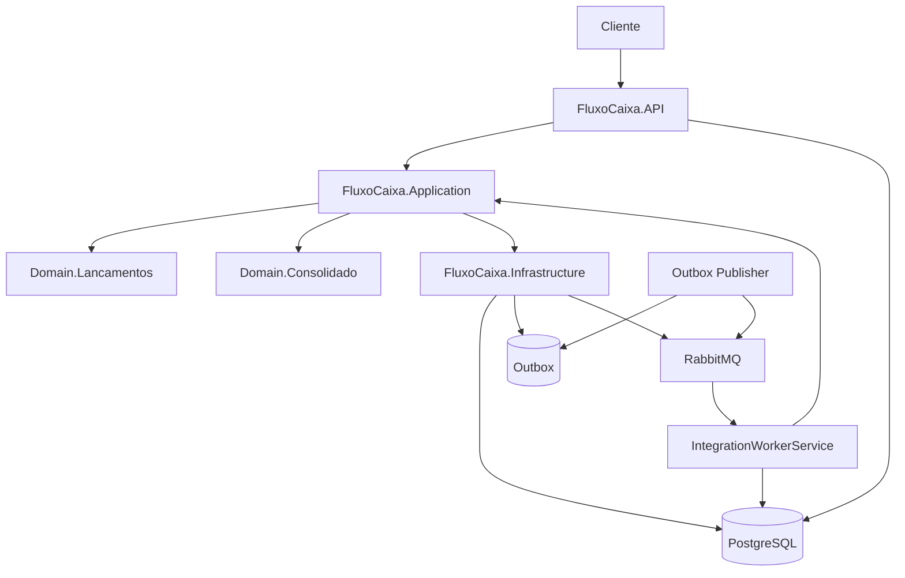
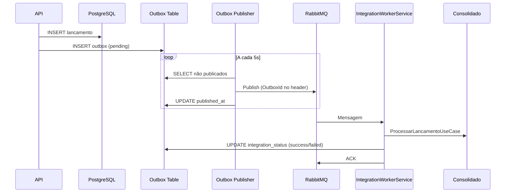

# Sistema de Controle de Fluxo de Caixa

Sistema de controle de fluxo de caixa em .NET 8 com DDD, Clean Architecture, Vertical Slices, Outbox Pattern, PostgreSQL, RabbitMQ e JWT.

## Índice

- [Visão Geral](#visão-geral)
- [Arquitetura](#arquitetura)
- [Tecnologias](#tecnologias)
- [Pré-requisitos](#pré-requisitos)
- [Como Executar](#como-executar)
- [Endpoints](#endpoints)
- [Testes](#testes)
- [Decisões Técnicas](#decisões-técnicas)

## Visão Geral

Sistema para controle de fluxo de caixa diário, permitindo:

- Registrar lançamentos (débitos e créditos)
- Listar e obter lançamentos com filtros e paginação
- Consultar consolidado diário do saldo
- Autenticação JWT

**Fluxo de dados:**

1. API recebe lançamento → salva na base + outbox
2. OutboxPublisherService publica eventos do outbox para RabbitMQ
3. IntegrationWorkerService (na mesma API) consome RabbitMQ → processa no consolidado → atualiza status no outbox
4. API de Consolidado consulta dados já processados

## Arquitetura

### Diagrama de Componentes



### Estrutura do Projeto

```
FluxoCaixa/
├── src/
│   ├── FluxoCaixa.Shared/          # Result, Serilog, Middlewares, Exceptions
│   ├── FluxoCaixa.Domain.Lancamentos/  # Lancamento, Valor, OutboxMessage, Eventos
│   ├── FluxoCaixa.Domain.Consolidado/  # ConsolidadoDiario, Data, Saldo
│   ├── FluxoCaixa.Application/     # Use Cases (Vertical Slices), Interfaces
│   ├── FluxoCaixa.Infrastructure/   # Dapper, Repositories, RabbitMQ, Outbox + IntegrationWorker
│   └── FluxoCaixa.API/             # Controllers, JWT, Swagger
├── tests/
│   ├── FluxoCaixa.Tests.Unit/
│   └── FluxoCaixa.Tests.Integration/
├── scripts/
│   ├── migrations/                 # SQL (lancamentos, outbox, consolidado_diario)
│   └── init-database.sh
└── docker-compose.yml
```

### Fluxo Outbox + IntegrationWorker



## Tecnologias

- **.NET 8** – Framework
- **PostgreSQL** – Banco de dados único
- **Dapper** – Acesso a dados
- **RabbitMQ** – Mensageria
- **Serilog** – Logging
- **JWT** – Autenticação
- **xUnit, Moq, FluentAssertions** – Testes

## Pré-requisitos

- [.NET 8 SDK](https://dotnet.microsoft.com/download/dotnet/8.0)
- [Docker](https://www.docker.com/get-started) e Docker Compose

## Como Executar

### Com Docker Compose

```bash
# Subir PostgreSQL, RabbitMQ, migration e API (Outbox + IntegrationWorker rodam na API)
docker-compose up -d

# Ver logs
docker-compose logs -f api
```

- **API**: http://localhost:5000  
- **Swagger**: http://localhost:5000/swagger  
- **Health**: http://localhost:5000/health  
- **RabbitMQ Management**: http://localhost:15672 (guest/guest)

### Sem Docker (desenvolvimento)

1. Subir PostgreSQL e RabbitMQ (ex.: via Docker apenas para esses serviços).
2. Criar banco e rodar migrations:

```bash
chmod +x scripts/init-database.sh
export DB_HOST=localhost DB_PORT=5432 POSTGRES_USER=postgres POSTGRES_PASSWORD=postgres DB_NAME=fluxocaixa
./scripts/init-database.sh
```

3. Rodar a API (OutboxPublisher e IntegrationWorker sobem junto):

```bash
dotnet run --project src/FluxoCaixa.API
```

## Endpoints

### Autenticação

```http
POST /api/auth/login
Content-Type: application/json

{"username": "admin", "password": "admin123"}

→ 200 OK: { "token": "...", "expiresAt": "..." }
```

### Lançamentos

```http
POST /api/lancamentos
Authorization: Bearer {token}
Content-Type: application/json

{"tipo": "Credito", "valor": 150.50, "descricao": "Venda", "dataLancamento": "2025-02-03"}

→ 201 Created: { "id": "...", "dataLancamento": "2025-02-03" }
```

```http
GET /api/lancamentos?dataInicio=2025-01-01&dataFim=2025-01-31&page=1&pageSize=20
Authorization: Bearer {token}

→ 200 OK: { "lancamentos": [...], "page": 1, "pageSize": 20, "totalCount": N }
```

```http
GET /api/lancamentos/{id}
Authorization: Bearer {token}

→ 200 OK: { "id": "...", "tipo": "Credito", "valor": 150.50, ... }
```

### Consolidado

```http
GET /api/consolidado/2025-02-03
Authorization: Bearer {token}

→ 200 OK: { "data": "2025-02-03", "saldo": 1250.75, "totalCreditos": 2500, "totalDebitos": 1249.25, "quantidadeLancamentos": 15 }
```

## Testes

```bash
# Todos os testes
dotnet test

# Apenas unitários
dotnet test tests/FluxoCaixa.Tests.Unit
```

## Decisões Técnicas

- **Projeto único**: uma API com dois Background Services (Outbox Publisher e Integration Worker), dois domínios (Lancamentos, Consolidado), um banco PostgreSQL.
- **Outbox Pattern**: evento gravado na mesma transação do lançamento; publicação assíncrona e consumo na mesma aplicação; atualização de status de integração no outbox pelo IntegrationWorkerService.
- **Vertical Slices**: use cases organizados por feature (RegistrarLancamento, ListarLancamentos, ObterConsolidadoDiario, ProcessarLancamento).
- **Dapper**: queries explícitas e controle de transação (UnitOfWork com mesma conexão).
- **Correlation ID**: middleware para rastreio de requisições nos logs.
- **DomainException**: exceções de domínio tratadas no middleware (400).

## Licença

Projeto desenvolvido como desafio técnico.
