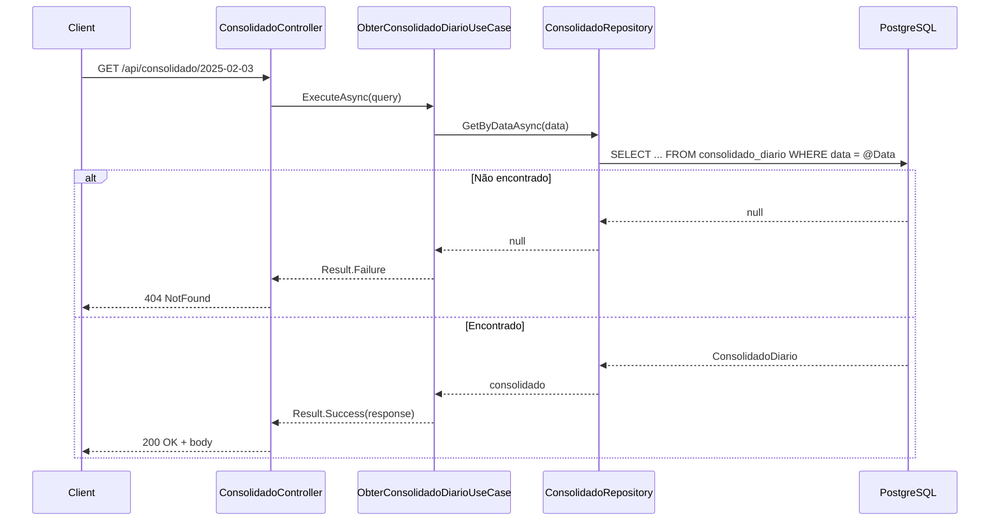

# GET /api/consolidado/{data}

Obtém o saldo consolidado diário para uma data.

## Descrição

O endpoint consulta a tabela `consolidado_diario` pela data. O consolidado é alimentado de forma assíncrona pelo Worker que processa eventos de lançamento publicados no RabbitMQ. A resposta pode ser cacheada por 5 minutos (ResponseCache).

## Diagrama de Sequência



## Request

**Headers**

- `Authorization: Bearer {token}` (obrigatório)

**Path Parameters**

| Parâmetro | Tipo | Descrição        |
|-----------|------|------------------|
| data      | date | Data do consolidado (ex: 2025-02-03) |

**Exemplo**

```
GET /api/consolidado/2025-02-03
```

## Response

**200 OK**

```json
{
  "data": "2025-02-03",
  "saldo": 1250.75,
  "totalCreditos": 2500.00,
  "totalDebitos": 1249.25,
  "quantidadeLancamentos": 15
}
```

**404 NotFound**

```json
{
  "type": "https://tools.ietf.org/html/rfc7231#section-6.5.4",
  "title": "Consolidado não encontrado",
  "status": 404,
  "detail": "Consolidado não encontrado para a data informada"
}
```

## Códigos de Status

| Código | Descrição       |
|--------|-----------------|
| 200    | Sucesso         |
| 401    | Não autenticado |
| 404    | Consolidado não encontrado para a data |
