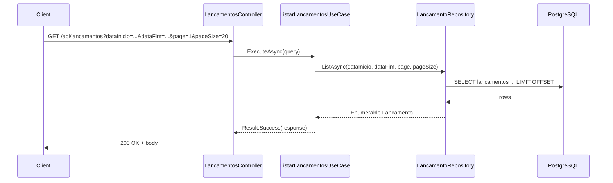

# GET /api/lancamentos

Lista lançamentos com filtros opcionais e paginação.

## Descrição

O endpoint consulta a tabela `lancamentos` com filtro por intervalo de datas e retorna uma página de resultados ordenados por data e criação.

## Diagrama de Sequência



## Request

**Headers**

- `Authorization: Bearer {token}` (obrigatório)

**Query Parameters**

| Parâmetro   | Tipo    | Obrigatório | Default | Descrição              |
|-------------|---------|-------------|---------|------------------------|
| dataInicio  | date    | Não         | -       | Data inicial (inclusive) |
| dataFim     | date    | Não         | -       | Data final (inclusive)  |
| page        | int     | Não         | 1       | Página                 |
| pageSize    | int     | Não         | 20      | Itens por página       |

**Exemplo**

```
GET /api/lancamentos?dataInicio=2025-01-01&dataFim=2025-01-31&page=1&pageSize=20
```

## Response

**200 OK**

```json
{
  "lancamentos": [
    {
      "id": "3fa85f64-5717-4562-b3fc-2c963f66afa6",
      "tipo": "Credito",
      "valor": 150.50,
      "descricao": "Venda",
      "dataLancamento": "2025-02-03",
      "createdAt": "2025-02-03T12:00:00Z"
    }
  ],
  "page": 1,
  "pageSize": 20,
  "totalCount": 1
}
```

## Códigos de Status

| Código | Descrição       |
|--------|-----------------|
| 200    | Sucesso         |
| 401    | Não autenticado |
