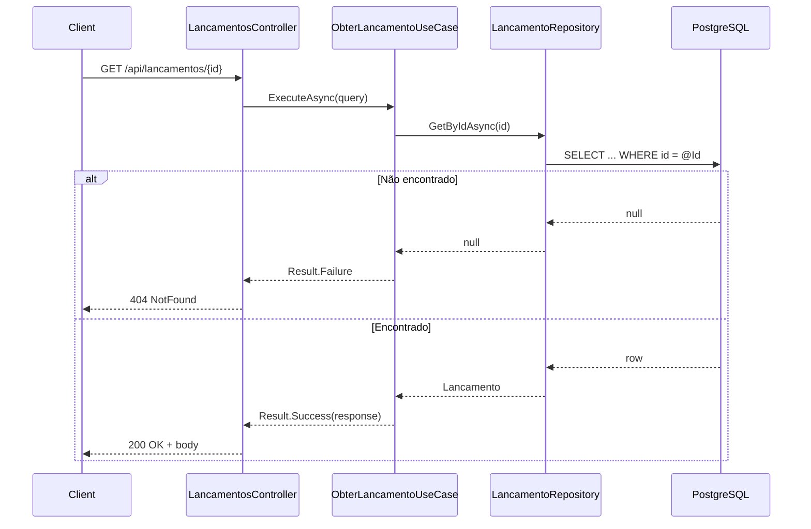

# GET /api/lancamentos/{id}

Obtém um lançamento pelo identificador.

## Descrição

O endpoint consulta a tabela `lancamentos` pelo `id` e retorna o lançamento ou 404 se não existir.

## Diagrama de Sequência



## Request

**Headers**

- `Authorization: Bearer {token}` (obrigatório)

**Path Parameters**

| Parâmetro | Tipo | Descrição   |
|-----------|------|-------------|
| id        | guid | ID do lançamento |

**Exemplo**

```
GET /api/lancamentos/3fa85f64-5717-4562-b3fc-2c963f66afa6
```

## Response

**200 OK**

```json
{
  "id": "3fa85f64-5717-4562-b3fc-2c963f66afa6",
  "tipo": "Credito",
  "valor": 150.50,
  "descricao": "Venda",
  "dataLancamento": "2025-02-03",
  "createdAt": "2025-02-03T12:00:00Z"
}
```

**404 NotFound**

```json
{
  "type": "https://tools.ietf.org/html/rfc7231#section-6.5.4",
  "title": "Lançamento não encontrado",
  "status": 404,
  "detail": "Lançamento não encontrado"
}
```

## Códigos de Status

| Código | Descrição       |
|--------|-----------------|
| 200    | Sucesso         |
| 401    | Não autenticado |
| 404    | Lançamento não encontrado |
