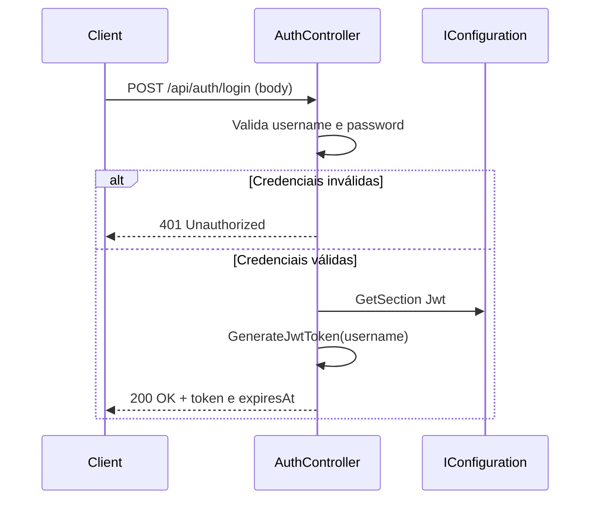

# POST /api/auth/login

Autentica o usuário e retorna um token JWT.

## Descrição

Recebe usuário e senha, valida e retorna JWT (60 min). Credenciais de exemplo: admin/admin123.

## Diagrama de Sequência



## Request

**Headers**

- `Content-Type: application/json`

**Body**

```json
{
  "username": "admin",
  "password": "admin123"
}
```

| Campo    | Tipo   | Obrigatório | Descrição   |
|----------|--------|-------------|-------------|
| username | string | Sim         | Nome do usuário |
| password | string | Sim         | Senha       |

**Exemplo:** `admin` / `admin123`

## Response

**200 OK**

```json
{
  "token": "eyJhbGciOiJIUzI1NiIsInR5cCI6IkpXVCJ9...",
  "expiresAt": "2025-02-03T13:00:00Z"
}
```

**401 Unauthorized**

```json
{
  "message": "Credenciais inválidas"
}
```

## Códigos de Status

| Código | Descrição           |
|--------|---------------------|
| 200    | Token gerado        |
| 401    | Credenciais inválidas |
