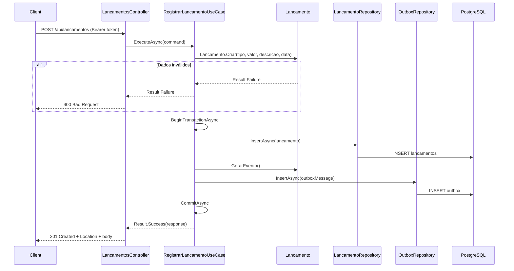

# POST /api/lancamentos

Registra um novo lançamento (débito ou crédito) no fluxo de caixa.

## Descrição

O endpoint recebe os dados do lançamento, valida via domínio, persiste na tabela `lancamentos` e grava o evento na tabela `outbox` na mesma transação. O Outbox Publisher publica o evento no RabbitMQ de forma assíncrona.

## Diagrama de Sequência



## Request

**Headers**

- `Authorization: Bearer {token}` (obrigatório)
- `Content-Type: application/json`

**Body**

```json
{
  "tipo": "Credito",
  "valor": 150.50,
  "descricao": "Venda",
  "dataLancamento": "2025-02-03"
}
```

| Campo          | Tipo     | Obrigatório | Descrição                          |
|----------------|----------|-------------|------------------------------------|
| tipo           | string   | Sim         | "Credito" ou "Debito"              |
| valor          | decimal  | Sim         | Valor positivo                     |
| descricao      | string   | Sim         | Até 200 caracteres                 |
| dataLancamento | date     | Sim         | Data do lançamento (ISO 8601)      |

## Response

**201 Created**

```json
{
  "id": "3fa85f64-5717-4562-b3fc-2c963f66afa6",
  "dataLancamento": "2025-02-03"
}
```

**400 Bad Request** (validação ou tipo inválido)

```json
{
  "type": "https://tools.ietf.org/html/rfc7231#section-6.5.1",
  "title": "Erro ao registrar lançamento",
  "status": 400,
  "detail": "Descrição é obrigatória"
}
```

## Códigos de Status

| Código | Descrição                    |
|--------|------------------------------|
| 201    | Lançamento registrado         |
| 400    | Dados inválidos ou tipo errado |
| 401    | Não autenticado              |
